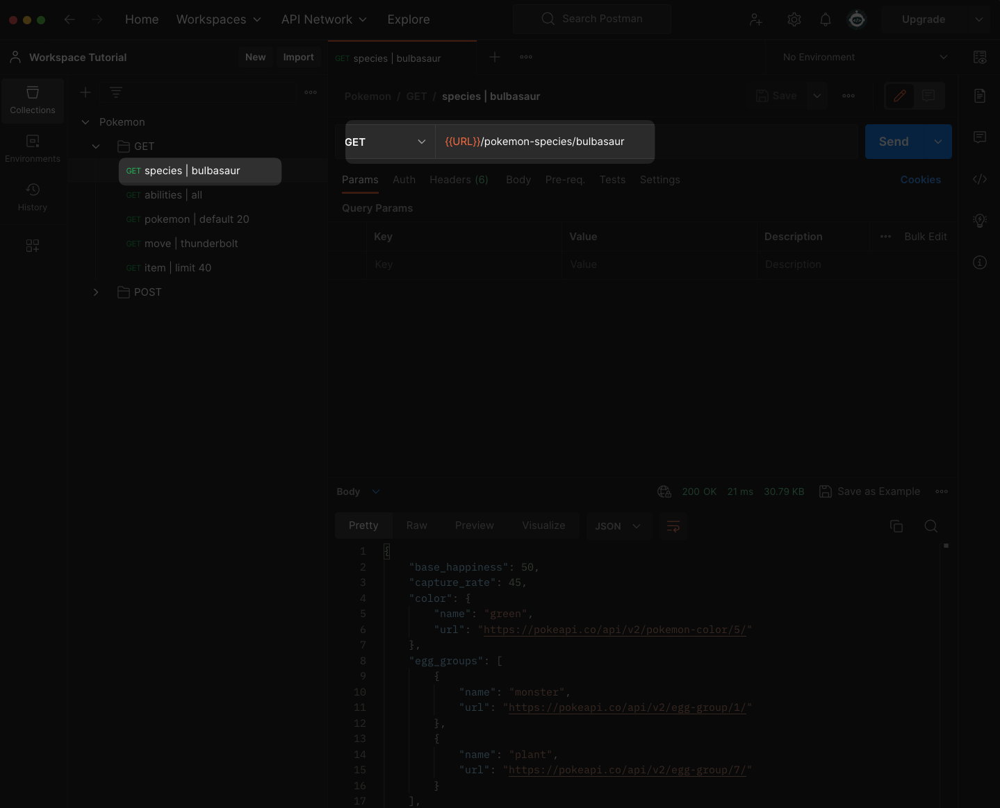
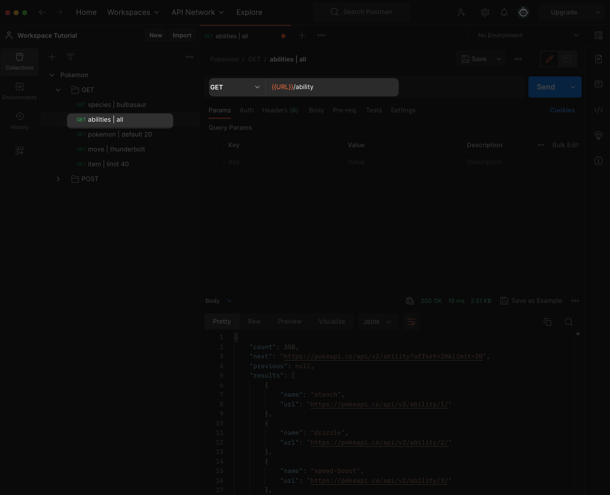
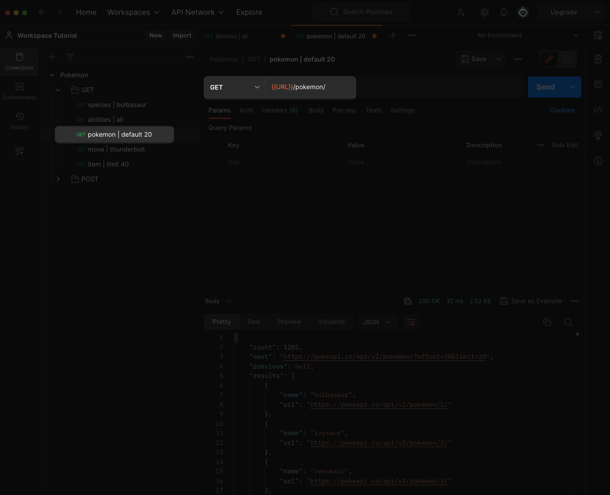
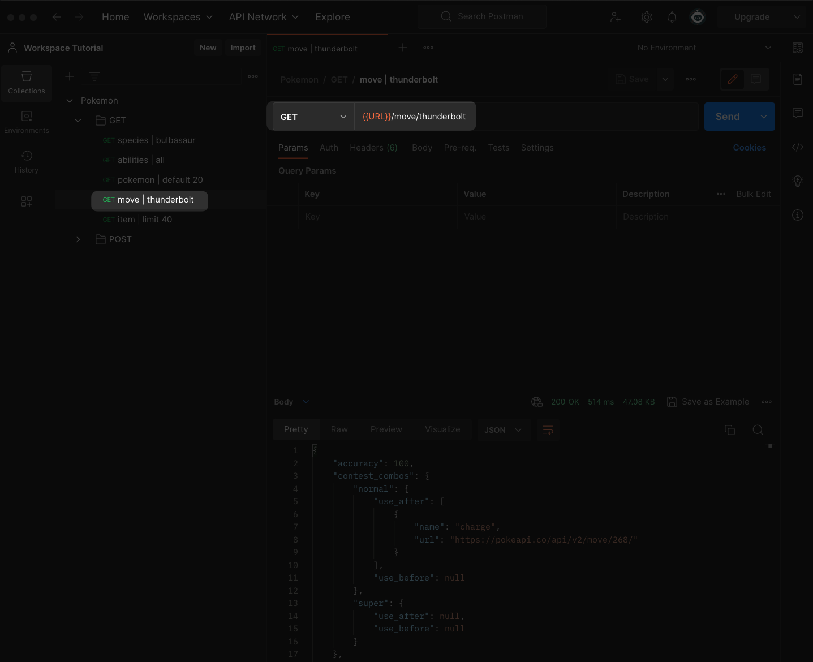
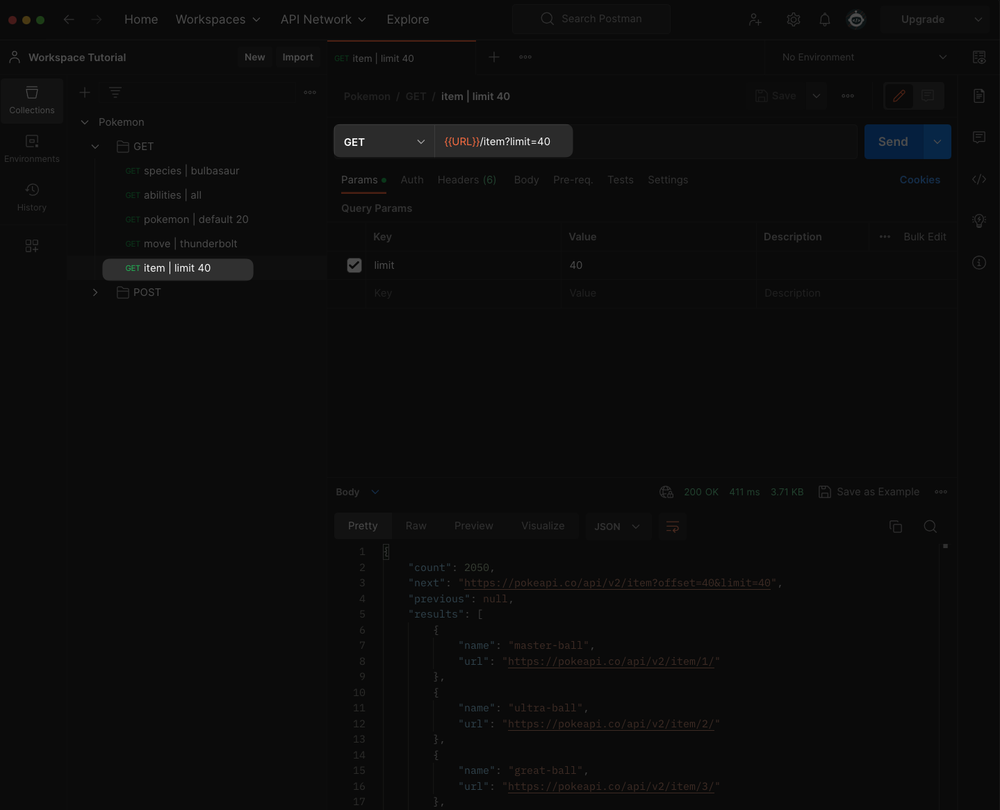

# Practice Assignment "Postman + Pokemon"

This is Christian Johnson's work for Coding Dojo's Part-Time Accelerated MERN Stack.
It was submitted on April 27, 2023.

## Assignment description

This assignment was to make 5 API requests to the PokemonAPI via the Postman app

## Additional Embeleshments

In addition to API requests I learned a little about Postman folder-scoped variables.

